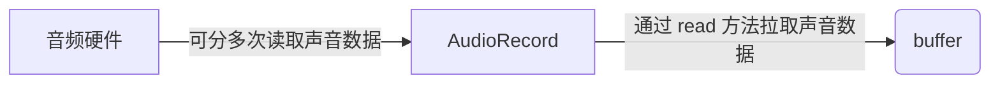
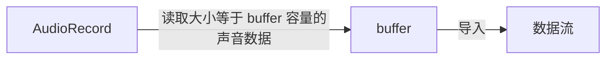

#### 关于 AudioRecord
Android SDK 提供了两套音频采集的API，分别是：MediaRecorder 和 AudioRecord，前者是一个更加上层一点的API，它可以直接把手机麦克风录入的音频数据进行编码压缩（如AMR、MP3等）并存成文件，而后者则更接近底层，能够更加自由灵活地控制，可以得到原始的一帧帧PCM音频数据。

如果想简单地做一个录音机，录制成音频文件，则推荐使用 MediaRecorder，而如果需要对音频做进一步的算法处理、或者采用第三方的编码库进行压缩、以及网络传输等应用，则建议使用 AudioRecord，其实 MediaRecorder 底层也是调用了 AudioRecord 与 Android Framework 层的 AudioFlinger 进行交互的。

音频的开发，更广泛地应用不仅仅局限于本地录音，因此，我们需要重点掌握如何利用更加底层的 AudioRecord API 来采集音频数据（注意，使用它采集到的音频数据是原始的PCM格式，想压缩为mp3,aac等格式的话，还需要专门调用编码器进行编码）。

#### AudioRecord 的参数配置
- **audioSource：音频采集的输入源**

	可选的值以常量的形式定义在 MediaRecorder.AudioSource 类中，常用的值包括：
	- [x] 1. DEFAULT (默认)
	- [x] 2. VOICE_RECOGNITION (用于语音识别，等同于 DEFAULT )
	- [x] 3. MIC (由手机麦克风输入)
	- [x] 4. VOICE_COMMUNICATION (用于 VoIP 应用)等等

- **sampleRateInHz: 采样率**

	目前 44100Hz 是唯一可以保证兼容所有 Android 手机的采样率。

- **channelConfig: 通道数**

	可选的值以常量的形式定义在 AudioFormat 类中，常用的是
	- [x] 1. CHANNEL_IN_MONO (单通道)
	- [x] 2. CHANNEL_IN_STEREO（双通道）

- **audioFormat: 数据位宽**

	可选的值以常量的形式定义在 AudioFormat 类中，常用的是( 1 是可以保证兼容所有Android手机的)
	- [x] 1. ENCODING_PCM_16BIT（16bit）
	- [x] 2. ENCODING_PCM_8BIT（8bit）

- **bufferSizeInBytes：AudioRecord 内部的音频缓冲区的大小**

	该缓冲区的值不能低于一帧“音频帧”（Frame）的大小：

	> int size = 采样率 x 位宽 x 采样时间 x 通道数

	采样时间一般取 2.5ms~120ms 之间，由厂商或者具体的应用决定，我们其实可以推断，每一帧的采样时间取得越短，产生的延时就应该会越小，当然，碎片化的数据也就会越多。

	在Android开发中，AudioRecord 类提供了一个帮助你确定这个 bufferSizeInBytes 的函数，原型如下：

	> int getMinBufferSize(int sampleRateInHz, int channelConfig, int audioFormat);

	不同的厂商的底层实现是不一样的，但无外乎就是根据上面的计算公式得到一帧的大小，音频缓冲区的大小则必须是一帧大小的2～N倍。实际开发中，强烈建议由该函数计算出需要传入的 bufferSizeInBytes，而不是自己手动计算。

#### 流程

- **设置所有 AudioRecord 参数**

	```
	    // 音频输入-麦克风
	    private final static int AUDIO_INPUT = MediaRecorder.AudioSource.MIC;
	    // 采样频率 一般共分为 22.05KHz、44.1KHz、48KHz 三个等级
	    // 44100 是目前的标准，但是某些设备仍然支持 22050，16000，11025
	    private final static int AUDIO_SAMPLE_RATE = 44100;
	    // 声道 单声道
	    private final static int AUDIO_CHANNEL = AudioFormat.CHANNEL_IN_MONO;
	    // 编码
	    private final static int AUDIO_ENCODING = AudioFormat.ENCODING_PCM_16BIT;
	    // 缓冲区字节大小
	    private int bufferSizeInBytes = 0;
	    // 录音对象
	    private AudioRecord audioRecord;
	```
- **创建 AudioRecord 并且获取缓冲区字节大小**

	```
	    /**
	     * 创建默认的录音对象
	     *
	     * @param fileName 文件名
	     */
	    public void createDefaultAudio(String fileName) {
	        // 获得缓冲区字节大小，AudioRecord 能接受的最小的 buffer 大小
	        bufferSizeInBytes = AudioRecord.getMinBufferSize(AUDIO_SAMPLE_RATE, AUDIO_CHANNEL, AUDIO_ENCODING);
	        // 创建默认的录音对象并且设置一系列配置
	        audioRecord = new AudioRecord(AUDIO_INPUT, AUDIO_SAMPLE_RATE, AUDIO_CHANNEL, AUDIO_ENCODING, bufferSizeInBytes);
	        this.fileName = fileName;
	    }
	```
- **创建 buffer (用于保存新的声音数据)，设置 buffer 大小(录制声音数据容量大小)**

	```
	    // new 一个 byte 数组用来存一些字节数据，大小为缓冲区大小
	    byte[] audiodata = new byte[bufferSizeInBytes];
	```

- **开始录音**

	```
	audioRecord.startRecording();
	// 标志位, 用于控制停止数据流读写循环
	isRecording = true;
	```
- **开始采集，一边从AudioRecord中读取声音数据到初始化的buffer，一边将buffer中数据导入数据流**

	```
	    // 开个子线程将录音的数据放入pcm文件
	    new Thread(new Runnable() {
	        @Override
	        public void run() {
	            writeDataTOFile(listener);
	        }
	    }).start();

	    // 如何将音频写入文件是重点，我写个伪代码，说明这个代码运行顺序
	    // 首先创建 pcm 文件，得到他的 FileOutputStream，然后不断循环 AudioRecord 通过 read 将录音的数据放入字节数组里，
	    // 当录音结束的时候要记得停止这个循环
	    FileOutputStream fos = null;
	    int readsize = 0;
	    try {
	        File file = new File(currentFileName);
	        if (file.exists()) {
	            file.delete();
	        }
	        // 建立一个可存取字节的文件
	        fos = new FileOutputStream(file);
	    } catch (IllegalStateException e) {
	        Log.e("AudioRecorder", e.getMessage());
	        throw new IllegalStateException(e.getMessage());
	    } catch (FileNotFoundException e) {
	        Log.e("AudioRecorder", e.getMessage());

	    }
	    while (isRecording) {
	        readsize = audioRecord.read(audiodata, 0, bufferSizeInBytes);
	        if (AudioRecord.ERROR_INVALID_OPERATION != readsize && fos != null) {
	            try {
	                fos.write(audiodata);
	            } catch (IOException e) {
	                Log.e("AudioRecorder", e.getMessage());
	            }
	        }
	    }
	```
- **关闭数据流**

	修改标志位：isRecording 为false，上面的while循环就自动停止了，数据流也就停止流动了，Stream也就被关闭了。
	```
	isRecording = false;
	```
- **停止录音**

	只要AudioRecord.stop就可以暂停录音了，然后当继续录音时在AudioRecord.start就好了，但是要另创建一个pcm记录，当录音结束时我们要将这些pcm一起转换为一个wav，

	至于pcm转换为wav的代码是固定的
	停止录音之后，注意要释放资源。

	```
	if (null != audioRecord) {
	    audioRecord.stop();
	    audioRecord.release();
	    audioRecord = null;
	    recordingThread = null;
	}
	```
#### 流程走向
- buffer 从 AudioRecord 中拉取声音数据

- 创建一个数据流，开启一个线程，一边从 AudioRecord 中读取数据，一边将数据导入到数据流中

#### 参考文献
- [Android音频开发（2）：如何采集一帧音频](https://blog.51cto.com/ticktick/1749719)
- [Android 音视频开发(二)：使用 AudioRecord 采集音频PCM并保存到文件](https://www.cnblogs.com/renhui/p/7457321.html)
- [Android 音视频深入](https://www.cnblogs.com/jianpanwuzhe/p/8403784.html)


